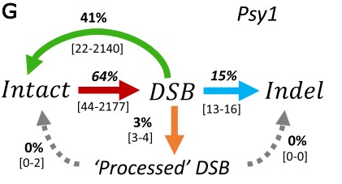
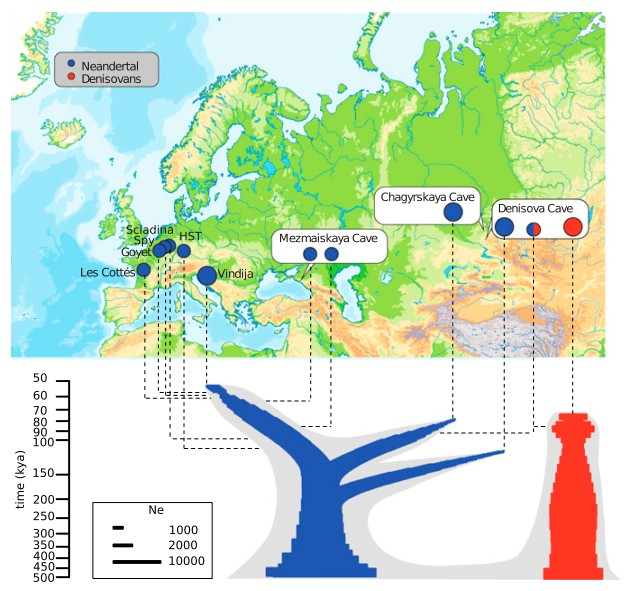
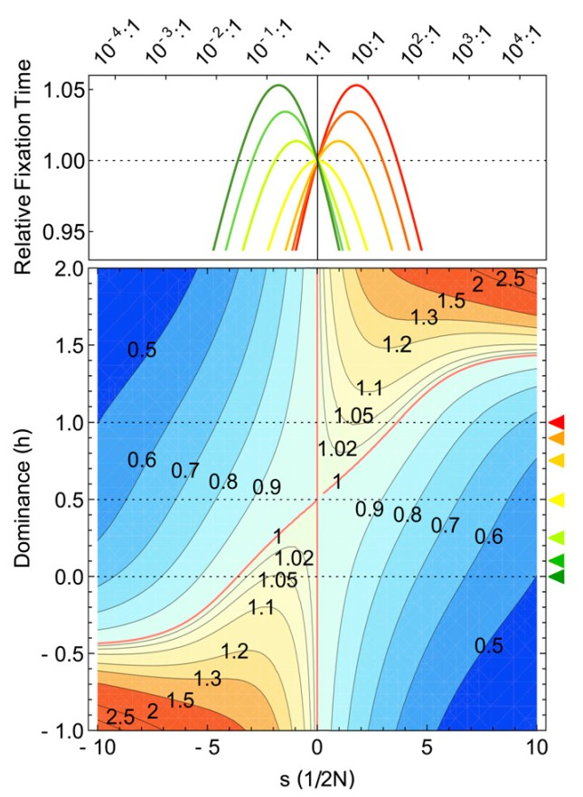

## Selected Research

::: {.grid}
::: {.g-col-4}

:::
::: {.g-col-8}
**[Uncovering the dynamics of precise repair at CRISPR/Cas9-induced double-strand breaks](https://www.nature.com/articles/s41467-024-49410-x)**

**Nature Communications*, 2024 — Often in literature it is assumed that when both strands of DNA break, leading to DNA Double Strand Breaks (DSB), they will be most often repaired inaccurately. However, using CRISPR in tomato plants and modeling the dynamics of DNA repair, we could infer that DNA is repaired precisely to a remarkable degree. Note that often people equate the amount of edits (for example indels) that CRISPR will generate to its "efficiency". By showing that an important proportion of cuts is in fact invisible, we invite researchers to take explicitly into account DNA repair mechanisms to predict CRIPSR efficiency.
:::
:::

---

::: {.grid}
::: {.g-col-4}

:::
::: {.g-col-8}
**[A high-coverage Neandertal genome from Chagyrskaya Cave](https://doi.org/10.1073/pnas.2004944117)**

**PNAS**, 2020 — When working at the Max Planck For Evolutionary Anthropology I had the amazing opportunity to work on the third-high coverage Neanderthal genome. The Neanderthal from Chagyrskaya was challenging to work on (what to say with a third Neanderthal that could not be said with just two?) but also incredibly rewarding. First of all, it confirmed us that Neanderthals spread several times eastwards towards Siberia, and together with archaeological findings, this probably represent the earliest (or one of the earliest) documented cultural and population replacement. Second, the Neanderthal from Chagyrskaya showed a massive portion of the genome devoid of diversity. This led us to revisit the notion that the Altai Neanderthal in 2014 had a similar pattern because product of inbreeding: perhaps inbreeding was the default in Siberia. With some metapopulation modeling I could show that Neanderthals in Siberia likely differed from modern humans, Denisovans and likely even western Neanderthal (after all Siberia is the extreme east of their geographical distribution), and likely lived in small population of less than 50 individuals. Of course these inferences are limited by the small number of sequenced archaic genomes. But in a more recent study by Massilani et al. (PNAS,2026) we could confirm this prediction.
:::
:::

---

::: {.grid}
::: {.g-col-4}

:::
::: {.g-col-8}
**[Selective Strolls: Fixation and Extinction in Diploids Are Slower for Weakly Selected Mutations Than for Neutral Ones](https://doi.org/10.1534/genetics.115.178160)**

*Genetics*, 2015 — A common belief in population genetics is that positively selected mutation reach fixation more rapidly than neutral ones - a phenomenon which leads to the so-called "selective sweeps". And viceversa, that deleterious mutations reach extinction more rapidly than neutral ones. Michael and I showed that this is not true for weakly selected mutations, which account for a large portion of newly occurring mutations. In fact, in diploids, fixation times for weak dominant mutations under positive selection are slower than for neutral ones. And weakly deleterious recessive mutations have slower extinction times than neutral, accumulating at low frequencies, where they have longer sojourn times than neutral ones. I still find pretty incredible that weak selection behaves in this respect almost in the opposite way of strong selection, and that such property - probably because so counterintuitive - remained hidden in plain sight from Kimura, Ohta, and all the amazing population geneticists which explored the stochastic dynamics of selected alleles before.
:::
:::
